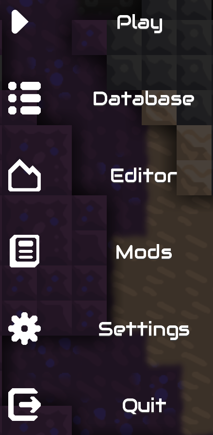
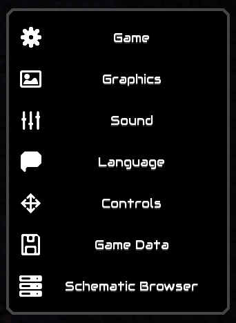
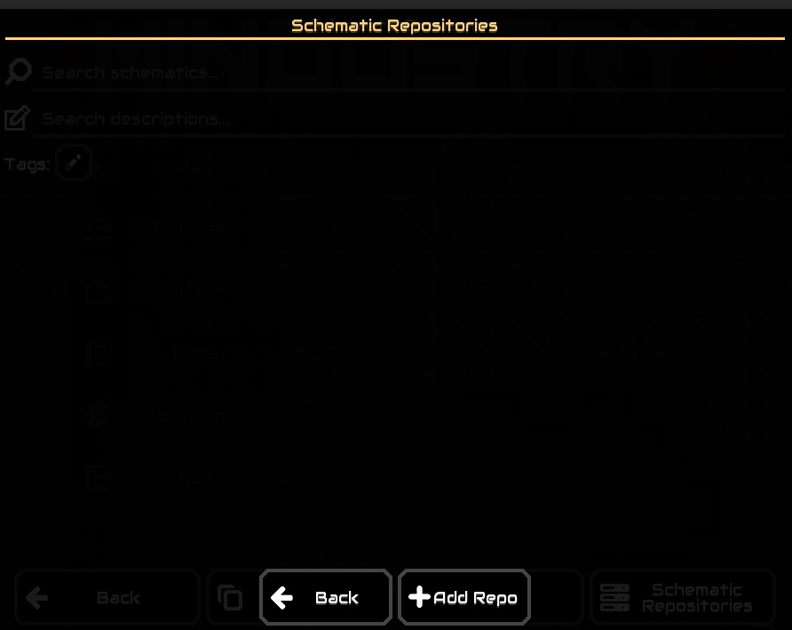

This repo contains some schematics for Mindustry.

## How to use

1. In the Mindustry menu, choose “Mods”.
2. Open the mod browser.
3. Search for “schematic browser” and install the mod.[!screenshot of the search results with the Schematic Browser mod](images/mod-search.png)
4. After restarting Mindustry, choose “Schematic Browser” in settings.
5. Type “holmes-g/schematics” in the text field and click the + button to add this repository to the list.
