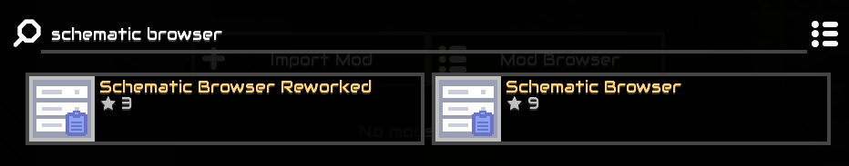

This repo contains some schematics for Mindustry.

## How to use

The best way is to use [Schematic Browser](https://github.com/eeve-lyn/schematic-browser), which lets you insert schematics from GitHub repositories without needing to first add them to your collection.

1. In the Mindustry menu, choose “Mods”.
2. Open the mod browser.  

3. Search for “schematic browser” and install the mod.  

4. After restarting Mindustry, choose “Schematic Browser” in settings.  

5. Type “holmes-g/schematics” in the text field and click the + button to add this repository to the list.  

6. Restart Mindustry.
7. From the normal schematics view in Mindustry, choose “Schematic Browser” at any time to view schematics from added repositories and click on them to place in-game.  

