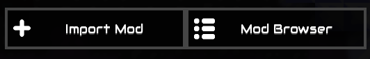

This repo contains some schematics for Mindustry.

## How to use

The best way is to use the [Schematic Browser](https://github.com/MindustryDesignIt/schematic-browser-mod) mod, which lets you insert schematics from GitHub repositories without needing to first add them to your collection.

1. In the Mindustry menu, choose “Mods”.
2. Open the mod browser.  

3. Search for “schematic browser” and install the mod.  

4. After restarting Mindustry, choose “Database” then “Schematics” in the menu, click on the “Schematic Browser” button, then “Schematic Repositories”.  

5. Click on “Add Repo” and type “holmes-g/schematics” in the text field then confirm with “Add Repo”.  

6. Click on the “Fetch” button to fetch schematics from configured repositories.
7. From the normal schematics view in Mindustry, choose “Schematic Browser” at any time to view schematics from added repositories and click on them to place in-game.  

